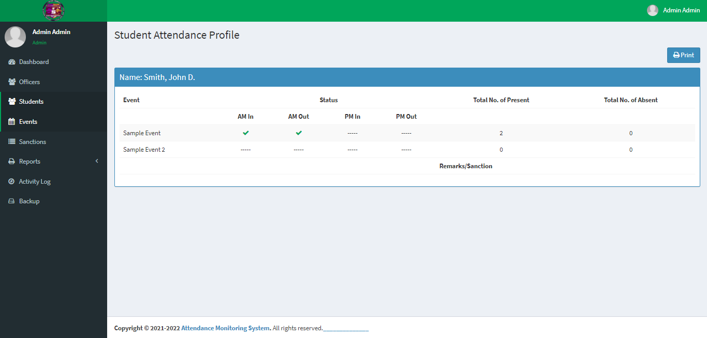

# School Event Attendance Monitoring System with Barcode Scanning using PHP

### Description

The School Event Attendance Monitoring System with Barcode Scanning is a PHP Project that manages the School's Student Attendance in Events. The purpose of this system is to improve the process of checking the attendance of the students in CHMSC and monitor their attendance in every school event.

### Features

<ul>
  <li><strong>Add Students</strong></li>
  <li><strong>Add Officers</strong></li>
  <li><strong>Add Event</strong></li>
  <li><strong>Manage Students</strong></li>
  <li><strong>Manage Officers</strong></li>
  <li><strong>Manage Event</strong></li>
  <li><strong>Generate barcode using the ID number</strong></li>
  <li><strong>Checking of attendance using a barcode scanner</strong></li>
  <li><strong>Generate Reports</strong></li>
  <li><strong>Printing of students attendance</strong></li>
  <li><strong>Printing of sanction tickets</strong></li>
  <li><strong>Printing of attendance in every event</strong></li>
</ul>

Visit [sourcecodester.com](https://www.sourcecodester.com/php/12613/php-attendance-monitoring-system-barcode-scanning.html) for more details about this project.

### Website Info

| Title | School Event Attendance Monitoring System with Barcode Scanning using PHP with Source Code |
|:--|:--|
| Website | [www.sourcecodester.com](https://www.sourcecodester.com) |
| Link | https://www.sourcecodester.com/php/12613/php-attendance-monitoring-system-barcode-scanning.html |
| Language | PHP |
| Uploader/Developer | [Phrince Elmar](https://www.sourcecodester.com/users/phrince-elmar-plomines-aviles) |
